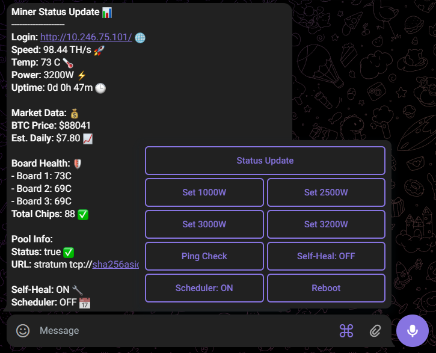

# 🚀 Antminer Telegram Monitor & Automation Bot (v5.0)

[](LICENSE)
[](https://braiins.com/os)

The most advanced **Antminer Monitoring Script** for Braiins OS. Control your Bitcoin mining farm remotely via Telegram with real-time stats, dual-layer auto-healing, and smart power scheduling.



## ✨ Key Features

### 📊 1. Real-Time Status Dashboard
Get a complete snapshot of your miner's health and profitability in a professional list format:

* **Live Total Hashrate:** Real-time total mining speed in **TH/s**.
* **💰 USD Market Data:** Live **Bitcoin Price ($)** and **Estimated Daily Earnings ($)** using CoinGecko API.
* **⚡ Power & Efficiency:** Tracks **Actual Power Consumption (W)** vs **Target (W)** with live **W/Ths** efficiency metrics.
* **🛡️ Full Board Health:** Detailed per-board stats including **Inlet Temp**, **Outlet (Chip) Temp**, and individual **Hashrate (TH/s)**.
* **✅ Chip Integrity:** Monitor total active chip count (e.g., 88 Chips) across all hashboards.
* **🕒 Uptime Tracking:** High-precision counter showing Days, Hours, and Minutes since the last boot.

### 🩹 2. Dual-Layer Self-Healing (Smart Watchdog)
Advanced automation to minimize downtime and maximize ROI:

* **Global Self-Heal:** Automatically detects system-wide hangs and reboots the miner if total hashrate hits **0 TH/s**.
* **Hashboard Self-Heal (New):** If a single board drops to **0 TH/s**, the script alerts you and waits **10 minutes** for recovery before rebooting.
* **🌐 Network Guard:** Built-in **Ping Check** prevents reboot loops by ensuring the miner only restarts when internet connectivity is active.
* *Both healing modes can be toggled independently via Telegram.*

### 📅 3. Smart Power Scheduler (Day/Night Mode)
Optimize electricity costs and hardware life with automatic power scaling:

* **Day Mode (10 AM - 10 PM):** Automatically scales down to **2500W** to prevent overheating during peak sun hours.
* **Night Mode (10 PM - 10 AM):** Boosts power target to **3200W** for maximum hashpower during cooler nights.
* *Fully toggleable via dedicated Telegram buttons.*

### 🛡️ 4. Safety & Critical Alerts
* **🔥 High Temp Alert:** Instant Telegram notifications if the average chip temperature crosses **80°C**.
* **💎 Encoding Optimization:** Fixed the common `??` emoji display bug on miner terminals for clean, readable Telegram messages.

### 🎮 5. Remote Control Center
Manage your Antminer farm without SSH or Web UI:

* **Instant Power Profiles:** Quick buttons to switch between **1000W, 2500W, 3000W, and 3200W**.
* **Remote Management:** Reboot the system or check network latency (ms) with a single tap.
* **Independent Toggles:** Dedicated ON/OFF buttons for **Self-Heal**, **Board-Heal**, and **Scheduler**.

---

## 🛠️ Performance & Reliability

* **🚀 On-Demand Fetching:** Optimized to eliminate lag. Heavy background tasks run only during "Status Update" requests.
* **Lightweight:** Pure shell script ensuring **<0.5% CPU overhead**.
* **NAND Protection:** Minimal write cycles to preserve the miner's internal flash memory life.
* **24/7 Stable:** Built-in error handling and network timeout protection for maximum uptime.
---

🛠️ Installation Guide
1. API Preparation
Initialize your teligram messaging bot interface to receive data.

Secure your unique API Tokens and access credentials.

2. Dependency Setup (Curl)
Download: Obtain the AARCH64 static binary for Curl. https://github.com/moparisthebest/static-curl/releases/tag/v8.11.0

Rename: Change the filename to curl.

Upload: Use WinSCP to transfer the file to the /etc/ directory on your miner.

Apply Permissions: SSH into your miner (ssh root@yourminerIP) and run:
```bash
chmod +x /etc/curl
```
4. API Connector (Netcat)
Install the network utility to interface with the BOSminer API. Execute this in your terminal:
```bash
/etc/curl -k -L -o /etc/nc https://busybox.net/downloads/binaries/1.31.0-defconfig-multiarch-musl/busybox-armv8l

chmod +x /etc/nc
```
4. Deploy Management Script
Create monitor.sh in the /etc/ directory.

Paste the code from this repository into the file.
Configuration: Insert your specific TOKEN and CHAT_ID in the script's header.
Final Permission: Enable execution:
```bash
chmod +x /etc/monitor.sh
```
5. Persistent Execution
To ensure the service resumes after a power cycle, edit /etc/rc.local (or /etc/rcS) and append this line at the bottom:
```bash
/etc/monitor.sh &
```

---

## ❓ Frequently Asked Questions (FAQ)

**Q: Is this script safe for my miner?**
**A:** Yes. It uses the official BOSminer API (read-only for status) and only modifies the power target in the config file when you press a button.

**Q: Does it slow down the hashrate?**
**A:** No. It is a lightweight shell script that consumes less than 1% of the miner's CPU.

**Q: What happens if my internet goes down?**
**A:** The script will wait for connectivity. We have added a `sleep` command and loop checks to ensure it doesn't crash during network loss.

**Q: Can I use this on Stock Firmware?**
**A:** No. This is specifically designed for **Braiins OS** because it relies on the `.toml` config and BOSminer API.

---


## 🔧 Component Troubleshooting (FAQ Style)

**Q: Why do I get a "Permission denied" error when running the script?** **A:** This happens because the binaries are not marked as executable. You must run `chmod +x /etc/curl /etc/nc /etc/monitor.sh` in your terminal to fix this.

**Q: The script says "command not found" for Curl or NC. What should I do?** **A:** Verify that the files are actually inside the `/etc/` directory. Also, ensure you downloaded the **AARCH64** version, as the miner's hardware will not recognize other architectures.

**Q: My bot is online but not sending any messages. How can I test it?** **A:** First, check if your miner has internet by running `ping api.telegram.org`. If it pings, double-check your **API Token** for typos; even one wrong character will break the connection.

**Q: Why are the Status updates showing empty or zero values?** **A:** This usually means the script cannot talk to the miner's internal API. Ensure **BOSminer** is running and that the API port **4028** is not blocked by any local settings.

**Q: Is the connection to Telegram secure?** **A:** Yes, but we use the `-k` flag with Curl to bypass SSL certificate verification. This is necessary because some miner firmware environments have outdated root certificates.

---

"This project is for educational purposes only. It is a remote monitoring tool for personal mining hardware and does not perform mining on GitHub servers."
